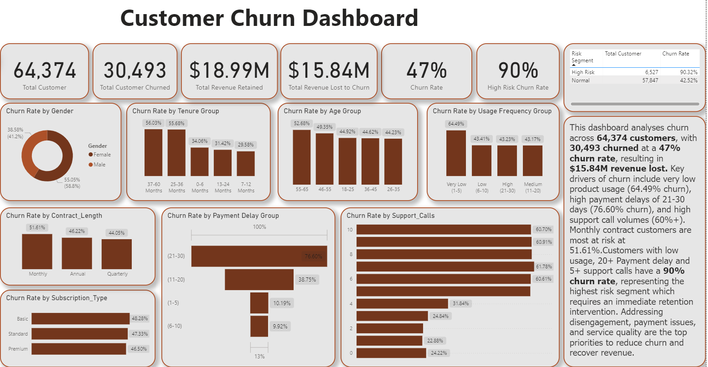
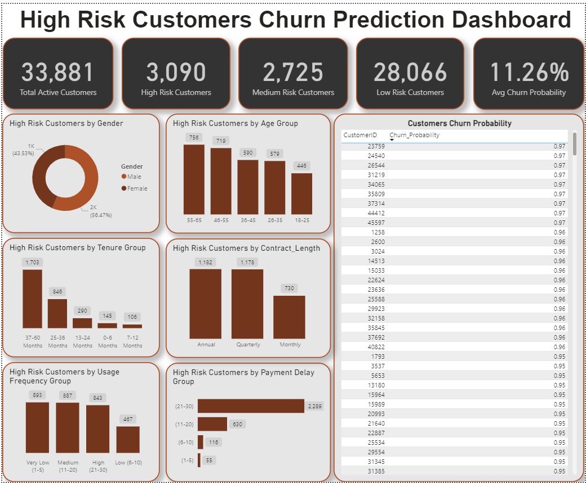
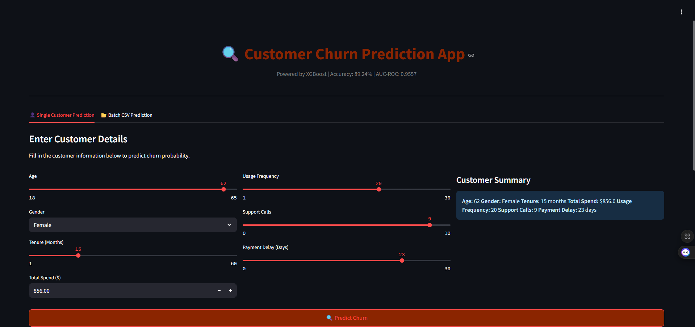
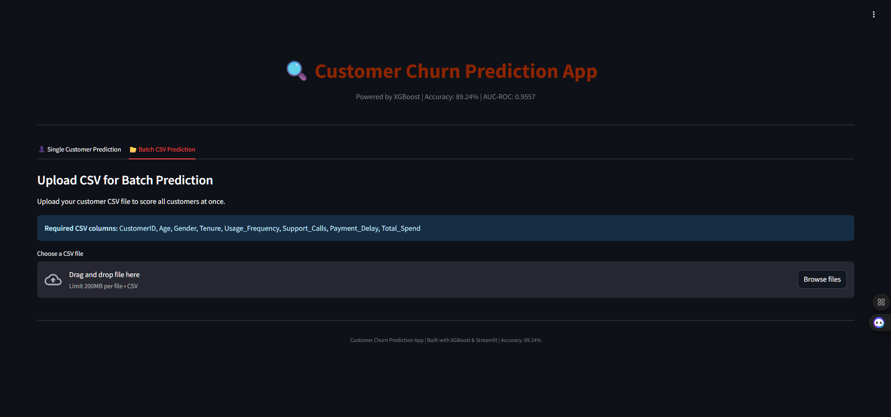

## 📌 Project Overview
An end-to-end customer churn analytics and machine learning project 
that combines Power BI dashboards and an XGBoost prediction model 
to identify customers at risk of churning.

The project analyses 64,374 customers, identifies key churn drivers, 
and deploys a live web application where users can predict churn 
probability for individual customers or upload a full CSV for batch scoring.

---
## 📸 Screenshots

### Customer Churn Dashboard (Power BI)


### High Risk Prediction Dashboard (Power BI)


### Streamlit App — Single Prediction


### Streamlit App — Batch Prediction


## 🚨 Business Problem
- **47% churn rate** across 64,374 customers
- **$15.84M revenue lost** to churn
- Business needed to identify **who will churn next** 
  before it happens

---

## 🎯 Project Objectives
- Understand the scale and financial impact of churn
- Identify key behavioral and demographic churn drivers
- Build an ML model to predict at-risk customers
- Deploy a live web app for real-time churn scoring
- Provide actionable retention strategies

---

## 📊 Dashboard Insights (Power BI)

| Metric | Value |
|--------|-------|
| Total Customers | 64,374 |
| Churned Customers | 30,493 |
| Churn Rate | 47% |
| Revenue Lost | $15.84M |
| Revenue Retained | $18.99M |
| High Risk Segment Churn Rate | 90.32% |

### Key Findings
- 🔴 **Payment Delay** is the #1 churn driver — 76.60% churn for 21-30 day delays
- 🔴 **Support Calls** — customers with 6+ calls churn at over 60%
- 🔴 **Long tenure customers** (37-60 months) churn the most at 56.03%
- 🔴 **Very low usage** customers churn at 64.49%
- 🔴 **Monthly contracts** churn at 51.61%

---

## 🤖 Machine Learning Models

| Model | Accuracy | AUC-ROC | Missed Churners |
|-------|----------|---------|-----------------|
| Logistic Regression | 81.21% | 0.8874 | 1,107 |
| Random Forest | 89.20% | 0.9539 | 320 |
| **XGBoost** ✅ | **89.24%** | **0.9557** | **319** |

### Feature Importance (XGBoost Gain)
1. Risk_Score (Payment Delay + Support Calls combined)
2. Gender
3. Total Spend
4. Engagement Score
5. Tenure
6. Usage Frequency
7. Age

---

## 🚀 Live App
👉 **[Launch Churn Prediction App](https://customerchurnprediction-puhmgfxlw7fyg52we4jamp.streamlit.app/)**

### App Features
- **Single Customer Prediction** — Enter customer details 
  and get instant churn probability
- **Batch CSV Prediction** — Upload full customer list 
  and score everyone at once
- **Risk Classification** — High / Medium / Low risk levels
- **Retention Recommendations** — Actionable advice per prediction
- **Download Results** — Export batch predictions as CSV

---

## 📁 Project Structure
```
customer-churn-prediction/
│
├── churn_app.py                  # Streamlit web application
├── churn_model.ipynb             # Jupyter notebook (full ML pipeline)
├── xgboost_churn_model.pkl       # Trained XGBoost model
├── scaler.pkl                    # Fitted StandardScaler
├── requirements.txt              # Python dependencies
└── README.md                     # Project documentation
```

---

## 🛠️ Tech Stack

| Tool | Purpose |
|------|---------|
| Python | Core programming language |
| Pandas & NumPy | Data manipulation |
| Scikit-Learn | Preprocessing & model evaluation |
| XGBoost | Churn prediction model |
| Matplotlib & Seaborn | Data visualization |
| Streamlit | Web application deployment |
| Power BI | Interactive dashboards |

---

## ⚙️ How to Run Locally

**1. Clone the repository**
```bash
git clone https://github.com/oyewolejerry2016/customer-churn-prediction.git
cd customer-churn-prediction
```

**2. Install dependencies**
```bash
pip install -r requirements.txt
```

**3. Run the Streamlit app**
```bash
streamlit run churn_app.py
```

---

## 📈 Churn Risk Scoring Results

| Risk Level | Customers | % of Active Base |
|------------|-----------|-----------------|
| 🔴 High Risk | 3,090 | 9.1% |
| 🟠 Medium Risk | 2,725 | 8.0% |
| 🟢 Low Risk | 28,066 | 82.9% |
| **Total Active** | **33,881** | **100%** |

---

## 💡 Retention Strategies

1. **Payment Delay Intervention** — Automated reminders at 7, 14, 21 days
2. **Support Experience Improvement** — First contact resolution focus
3. **Long Tenure Loyalty Program** — Reward customers beyond 24 months
4. **Re-engagement Campaigns** — Target low usage customers
5. **Contract Conversion** — Incentivize monthly to annual upgrades
6. **High Risk Outreach** — Dedicated team for 3,090 high risk customers

---

## 👤 Author
**Oyewole Jeremiah Oladayo**
- LinkedIn: [https://www.linkedin.com/in/oyewole-jeremiah-9711a3231/]
- Email: [oyewolejerry2016@gmail.com]

---

## 📄 License
This project is open source and available under the MIT License.
